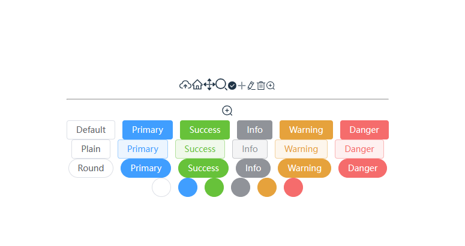

# 集成 element-plus 图标

## 安装

pnpm install element-plus @element-plus/icons-vue
pnpm i unplugin-icons

# 配置

vite.config.ts
配置如下：

```
import { defineConfig } from 'vite'
import vue from '@vitejs/plugin-vue'
// 以下三项引入是为配置Element-plus自动按需导入
import AutoImport from 'unplugin-auto-import/vite'
import Components from 'unplugin-vue-components/vite'
import { ElementPlusResolver } from 'unplugin-vue-components/resolvers'

// 使用 @ 代替/src
import { resolve } from 'path'

// svg plugin
import { createSvgIconsPlugin } from 'vite-plugin-svg-icons'

// 引入图标
import Icons from 'unplugin-icons/vite'
import IconsResolver from 'unplugin-icons/resolver'

// https://vitejs.dev/config/
export default defineConfig({
	plugins: [
		vue(),
		// 以下两项是为配置Element-plus自动按需导入
		AutoImport({
			// 自动导入 Vue 相关函数，如：ref, reactive, toRef 等
			imports: ['vue'],
			resolvers: [
				// 自动导入 Element Plus 相关函数，如：ElMessage, ElMessageBox... (带样式)
				ElementPlusResolver(),
				IconsResolver({
					prefix: 'icon'
				})
			]
		}),
		Components({
			resolvers: [
				// 自动注册图标组件
				IconsResolver({
					enabledCollections: ['ep']
				}),
				// 自动导入 Element Plus 组件
				ElementPlusResolver()
			]
		}),
		Icons({
			autoInstall: true
		}),
		// 修改 svg 相关配置
		createSvgIconsPlugin({
			// 指定需要缓存的图标文件夹
			iconDirs: [resolve(__dirname, './src/assets/svg')]
		})
	],
	resolve: {
		alias: [
			{
				find: '@',
				replacement: resolve(__dirname, './src')
			}
		]
	}
})

```

## element-plus 图标

参考：
https://element-plus.org/zh-CN/component/icon.html

## 使用

```
// src/views/test/index.vue
<script setup lang="ts">
const value = ref(true)
const menu = [
	{
		name: '增',
		icon: IconEpPlus
	},
	{
		name: '改',
		icon: IconEpEditPen
	},
	{
		name: '删',
		icon: IconEpDelete
	},
	{
		name: '放大',
		icon: IconEpZoomIn
	}
]
</script>

<template>
	<div>
		<svg-icon icon-class="upload" />
		<svg-icon icon-class="home" />
		<svg-icon icon-class="drag" />
		<svg-icon icon-class="search" />
		<el-icon>
			<!-- 原来是：<CircleCheckFilled /> -->
			I
			<i-ep-circle-check-filled />
		</el-icon>
		<el-icon v-for="item in menu" :key="item.name">
			<component :is="item.icon" />
		</el-icon>
		<hr />
		<el-icon :size="20">
			<i-ep-zoom-in />
		</el-icon>
		<el-icon :size="40">
			<i-ep-plus />
		</el-icon>
		<div class="mb-4">
			<el-button>Default</el-button>
			<el-button type="primary">Primary</el-button>
			<el-button type="success">Success</el-button>
			<el-button type="info">Info</el-button>
			<el-button type="warning">Warning</el-button>
			<el-button type="danger">Danger</el-button>
		</div>
		<hr />
		<div class="mb-4">
			<el-button plain>Plain</el-button>
			<el-button type="primary" plain>Primary</el-button>
			<el-button type="success" plain>Success</el-button>
			<el-button type="info" plain>Info</el-button>
			<el-button type="warning" plain>Warning</el-button>
			<el-button type="danger" plain>Danger</el-button>
		</div>
		<hr />
		<div class="mb-4">
			<el-button round>Round</el-button>
			<el-button type="primary" round>Primary</el-button>
			<el-button type="success" round>Success</el-button>
			<el-button type="info" round>Info</el-button>
			<el-button type="warning" round>Warning</el-button>
			<el-button type="danger" round>Danger</el-button>
		</div>
		<hr />
		<div>
			<el-button :icon="IEpSearch" circle />
			<el-button type="primary" :icon="Edit" circle />
			<el-button type="success" :icon="Check" circle />
			<el-button type="info" :icon="Message" circle />
			<el-button type="warning" :icon="Star" circle />
			<el-button type="danger" :icon="Delete" circle />
		</div>
		<div style="text-align: center; margin-top: 10px">
			<el-button type="primary" circle>
				<el-icon style="vertical-align: middle">
					<i-ep-plus />
				</el-icon>
			</el-button>
			<el-button type="success" :icon="IconEpPlus" circle>
				<el-icon style="vertical-align: middle">
					<i-ep-plus />
				</el-icon>
			</el-button>
			<el-button type="info" active-icon="IEpMoon" circle>
				<el-icon style="vertical-align: middle">
					<i-ep-moon />
				</el-icon>
			</el-button>
			<el-button type="warning" circle>
				<el-icon style="vertical-align: middle">
					<i-ep-zoom-in />
				</el-icon>
			</el-button>
			<el-button type="danger" circle>
				<el-icon style="vertical-align: middle">
					<i-ep-zoom-in />
				</el-icon>
			</el-button>

			<el-button type="primary">
				<el-icon style="vertical-align: middle">
					<i-ep-search />
				</el-icon>
				<span style="vertical-align: middle">Search</span>
			</el-button>
		</div>
		<hr />
		<div>
			<el-icon :size="20">
				<i-ep-edit />
			</el-icon>
			<el-icon color="#409EFC" class="no-inherit">
				<i-ep-share />
			</el-icon>
			<el-icon>
				<i-ep-delete />
			</el-icon>
			<el-icon class="is-loading">
				<i-ep-loading />
			</el-icon>
		</div>
		<div>
			<el-switch v-model="value" inline-prompt="true">
				<template #active-action>
					<span class="custom-active-action">
						<i-ep-delete />
					</span>
				</template>
				<template #inactive-action>
					<span class="custom-inactive-action">
						<i-ep-edit />
					</span>
				</template>
			</el-switch>
			<hr />
			<el-switch v-model="value">
				<template #active-action>
					<span class="custom-active-action">T</span>
				</template>
				<template #inactive-action>
					<span class="custom-inactive-action">F</span>
				</template>
			</el-switch>
			<hr />
			<el-switch v-model="value" size="large" active-text="Open" inactive-text="Close" />
			<br />
			<el-switch v-model="value" active-text="Open" inactive-text="Close" />
			<br />
			<el-switch v-model="value" size="small" active-text="Open" inactive-text="Close" />
		</div>
	</div>
</template>


```

参考：
https://juejin.cn/post/7289969035436884007?searchId=2024030716255555B13B7FAEF95598D8B3

引入 icon 的时候,在 icon 上面加 i-ep-即可

## 效果


