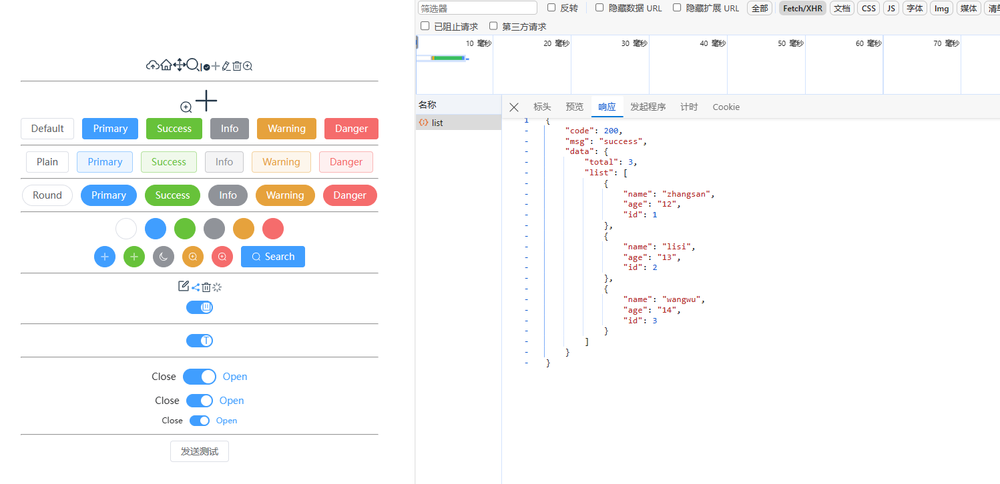

# 配置环境

## 创建文件

根目录：
.env
.env.development
.env.production
.env.test

## 配置 package.json

在键值 scripts 中添加

```
		"build:prod": "vue-tsc && vite build --mode production",
		"build:test": "vue-tsc && vite build --mode test",
```

因为开发环境和生产环境的端口不同，所以需要在命令中添加 --mode 参数，指定不同的环境变量文件

dev 环境下不需要添加--mode 参数，默认就是开发环境，即 development

## 配置 vite.config.ts

```ts
		server: {
			// 服务配置

			// 是否自动打开浏览器
			open: true,
			proxy: {
				'/api': {
					target: env.VITE_BASE_URL, // 代理目标地址
					secure: false, // https
					changeOrigin: true, // 代理时是否改变 origin
					rewrite: (path: string) => path.replace(/^\/api/, '')
				}
			}
		}
```

# axios 配置

## 安装

pnpm i axios --save

pnpm i --save-dev @types/node

## 使用

src/utils/request.ts

```
import Axios from 'axios'

import { ElMessage, ElMessageBox } from 'element-plus'

// vite 项目配置中，使用import.meta.env 拿到环境变量
// 参考：https://blog.csdn.net/weixin_45966674/article/details/133861553
// 创建axios 实例
const service = Axios.create({
	baseURL: import.meta.env.VITE_APP_BASE_API, // 从环境中获取url地址，也可写死。
	withCredentials: true, // 跨域时发送cookies是设置为 true
	timeout: 5000 // 超时时间
})

// 请求拦截器
service.interceptors.request.use(
	(config) => {
		// 在发送请求之前做些什么
		console.log(config)
		return config
	},
	(error) => {
		// 对请求错误做些什么
		console.log(error)
		return Promise.reject(error)
	}
)
// 响应拦截器
service.interceptors.response.use(
	(response) => {
		// 对响应数据做点什么
		console.log(response)
		return response
	},
	(error) => {
		// 对响应错误做点什么
		console.log(error)
		return Promise.reject(error)
	}
)

export default service

```

## 测试

根目录下创建 api 文件夹
api
->index.ts
->test
-->index.ts

api/test/index.ts 导出一个接口

```
export function getTestList(data) {
	return request({
		url: '/list',
		method: 'get',
		data
	})
}
```

在 src/views/test/index.vue 中测试

```
		<el-button @click="testApi">发送测试</el-button>

    import { getTestList } from '@/api/index'
    const value = ref(true)
    const testApi = () => {
      getTestList({}).then((res) => {
        console.log(res)
      })
    }
```

## 测试结果：


