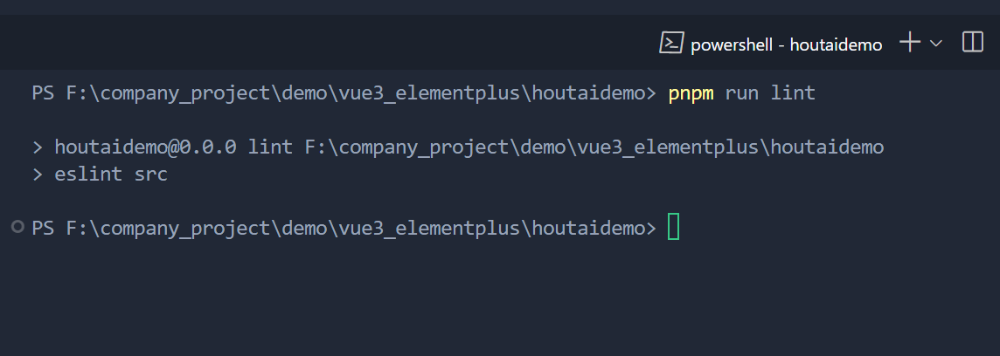
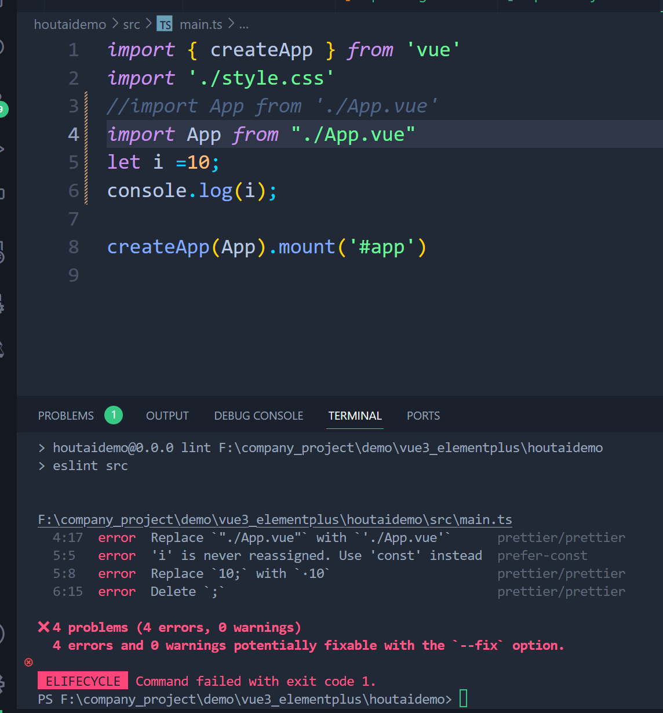
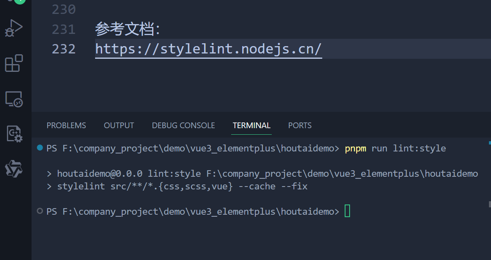
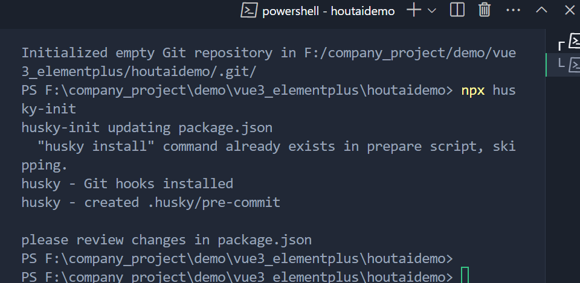

# 配置校验规则

# prettier

## 安装
pnpm install -D eslint-plugin-prettier prettier eslint-config-prettier

## 新建.prettierrc.json 文件
内容如下：

```
{
  "printWidth": 100,	//每行最多显示的字符数
  "tabWidth": 2,//tab的宽度 2个字符
  "useTabs": true,//使用tab代替空格
  "semi": false,//结尾使用分号
  "singleQuote": true,//使用单引号代替双引号
  "trailingComma": "none",//结尾是否添加逗号
  "bracketSpacing": true,//对象括号俩边是否用空格隔开
  "bracketSameLine": true,;//组件最后的尖括号不另起一行
  "arrowParens": "always",//箭头函数参数始终添加括号
  "htmlWhitespaceSensitivity": "ignore",//html存在空格是不敏感的
  "vueIndentScriptAndStyle": false,//vue 的script和style的内容是否缩进
  "endOfLine": "auto",//行结尾形式 mac和linux是\n  windows是\r\n 
  "singleAttributePerLine": false //组件或者标签的属性是否控制一行只显示一个属性
}

```
注意： 在.prettierrc.json 不用加注释

## 新建.prettierignore 文件
内容如下：
```
/dist/*
/html/*
.local
/node_modules/**
**/*.svg
**/*.sh
/public/*


```

## 运行
pnpm run lint

结果如下：


# eslint

## 安装eslint
pnpm i eslint -D

## 生成eslint 配置文件
pnpm eslint --init

运行后选择所需要的验证规则后，生成一个.eslintrc.cjs 文件

.cjs:表示遵循CommonJS 规范

补充rules 后.eslintrc.cjs 文件内容如下：
```
module.exports = {
    "env": {
        "browser": true,
        "es2021": true
    },
    "extends": [
        "eslint:recommended",
        "plugin:@typescript-eslint/recommended",
        "plugin:vue/vue3-essential",
        'plugin:prettier/recommended',
    ],
    "overrides": [
        {
            "env": {
                "node": true
            },
            "files": [
                ".eslintrc.{js,cjs}"
            ],
            "parserOptions": {
                "sourceType": "script"
            }
        }
    ],
    "parserOptions": {
        "ecmaVersion": "latest",
        "parser": "@typescript-eslint/parser",
        "sourceType": "module"
    },
    "plugins": [
        "@typescript-eslint",
        "vue"
    ],
    "rules": {
        // eslint（https://eslint.bootcss.com/docs/rules/）
    'no-var': 'error', // 要求使用 let 或 const 而不是 var
    'no-multiple-empty-lines': ['warn', { max: 1 }], // 不允许多个空行
    'no-console': process.env.NODE_ENV === 'production' ? 'error' : 'off',
    'no-debugger': process.env.NODE_ENV === 'production' ? 'error' : 'off',
    'no-unexpected-multiline': 'error', // 禁止空余的多行
    'no-useless-escape': 'off', // 禁止不必要的转义字符

    // typeScript (https://typescript-eslint.io/rules)
    '@typescript-eslint/no-unused-vars': 'error', // 禁止定义未使用的变量
    '@typescript-eslint/prefer-ts-expect-error': 'error', // 禁止使用 @ts-ignore
    '@typescript-eslint/no-explicit-any': 'off', // 禁止使用 any 类型
    '@typescript-eslint/no-non-null-assertion': 'off',
    '@typescript-eslint/no-namespace': 'off', // 禁止使用自定义 TypeScript 模块和命名空间。
    '@typescript-eslint/semi': 'off',

    // eslint-plugin-vue (https://eslint.vuejs.org/rules/)
    'vue/multi-word-component-names': 'off', // 要求组件名称始终为 “-” 链接的单词
    'vue/script-setup-uses-vars': 'error', // 防止<script setup>使用的变量<template>被标记为未使用
    'vue/no-mutating-props': 'off', // 不允许组件 prop的改变
    'vue/attribute-hyphenation': 'off' // 对模板中的自定义组件强制执行属性命名样式
    }
}

```

## 添加eslint 的忽视文件
在项目根目录下新建.eslintignore 文件，内容如下：
```
dist
node_modules
```
意思是：忽略dist 和node_modules 文件里的文件，不校验

## 添加脚本，在项目中进行校验
在packaeg.json 中script 字段中添加命令
"lint": "eslint src",
"fix": "eslint src --fix"

## 检查是否生效
修改main.ts 文件
```
import { createApp } from 'vue'
import './style.css'
//import App from './App.vue'
import App from "./App.vue"
let i =10;
console.log(i);

createApp(App).mount('#app')
```
如下图所示：

配置成功

# stylelint

## 安装scss 作为预处理
pnpm add sass sass-loader stylelint postcss postcss-scss postcss-html stylelint-config-prettier stylelint-config-recess-order stylelint-config-recommended-scss stylelint-config-standard stylelint-config-standard-vue stylelint-scss stylelint-order stylelint-config-standard-scss -D

## 新建.stylelintrc.cjs 配置文件
```
module.exports = {
    extends: [
      'stylelint-config-standard', // 配置stylelint拓展插件
      'stylelint-config-html/vue', // 配置 vue 中 template 样式格式化
      'stylelint-config-standard-scss', // 配置stylelint scss插件
      'stylelint-config-recommended-vue/scss', // 配置 vue 中 scss 样式格式化
      'stylelint-config-recess-order', // 配置stylelint css属性书写顺序插件,
      'stylelint-config-prettier', // 配置stylelint和prettier兼容
    ],
    overrides: [
      {
        files: ['**/*.(scss|css|vue|html)'],
        customSyntax: 'postcss-scss',
      },
      {
        files: ['**/*.(html|vue)'],
        customSyntax: 'postcss-html',
      },
    ],
    ignoreFiles: [
      '**/*.js',
      '**/*.jsx',
      '**/*.tsx',
      '**/*.ts',
      '**/*.json',
      '**/*.md',
      '**/*.yaml',
    ],
    /**
     * null  => 关闭该规则
     * always => 必须
     */
    rules: {
      'value-keyword-case': null, // 在 css 中使用 v-bind，不报错
      'no-descending-specificity': null, // 禁止在具有较高优先级的选择器后出现被其覆盖的较低优先级的选择器
      'function-url-quotes': 'always', // 要求或禁止 URL 的引号 "always(必须加上引号)"|"never(没有引号)"
      'no-empty-source': null, // 关闭禁止空源码
      'selector-class-pattern': null, // 关闭强制选择器类名的格式
      'property-no-unknown': null, // 禁止未知的属性(true 为不允许)
      'block-opening-brace-space-before': 'always', //大括号之前必须有一个空格或不能有空白符
      'value-no-vendor-prefix': null, // 关闭 属性值前缀 --webkit-box
      'property-no-vendor-prefix': null, // 关闭 属性前缀 -webkit-mask
      'selector-pseudo-class-no-unknown': [
        // 不允许未知的选择器
        true,
        {
          ignorePseudoClasses: ['global', 'v-deep', 'deep'], // 忽略属性，修改element默认样式的时候能使用到
        },
      ],
    },
  }
  
```

## 新建.stylelintignore 忽略文件
```
/node_modules/*
/dist/*
/html/*
/public/*

```

## 添加脚本
在package.json 中，添加
```
"lint:style": "stylelint src/**/*.{css,scss,vue} --cache --fix"

```
结果如下：

参考文档：
https://stylelint.nodejs.cn/

# husky

## 安装husky
pnpm install -D husky

## 生成配置文件
git init 
npx husky-init



在文件夹下会有.husky 里面有个文件 pre-commit 
在文件里面写有：
```
#!/usr/bin/env sh
. "$(dirname -- "$0")/_/husky.sh"

npm test

```

# 配置commitlint

## 安装commitlint 
pnpm add @commitlint/config-conventional @commitlint/cli -D

## 配置commitlint 
新建文件commitlint.config.cjs
内容如下：
```
module.exports = {
  extends: ['@commitlint/config-conventional'],
  // 校验规则
  rules: {
    'type-enum': [
      2,
      'always',
      [
        'feat',     //新特性、新功能
        'fix',      //修改bug
        'docs',     //文档修改
        'style',    //代码格式修改, 注意不是 css 修改
        'refactor', //代码重构
        'perf',     //优化相关，比如提升性能、体验
        'test',     //测试用例修改
        'chore',    //其他修改, 比如改变构建流程、或者增加依赖库、工具等
        'revert',   //回滚到上一个版本
        'build',    //编译相关的修改，例如发布版本、对项目构建或者依赖的改动
      ],
    ],
    'type-case': [0],
    'type-empty': [0],
    'scope-empty': [0],
    'scope-case': [0],
    'subject-full-stop': [0, 'never'],
    'subject-case': [0, 'never'],
    'header-max-length': [0, 'always', 72],
  },
}


```
## 添加脚本
在package.json 中添加配置
```
 "commitlint": "commitlint --config commitlint.config.cjs -e -V"

```
## 搭配husky 使用
npx husky add .husky/commit-msg 
## 添加命令
在.husky->commit-msg 中写入
#!/usr/bin/env sh
. "$(dirname -- "$0")/_/husky.sh"
pnpm commitlint


## 提交示例：
feat:xxx
docs:readme3.md 文档修改