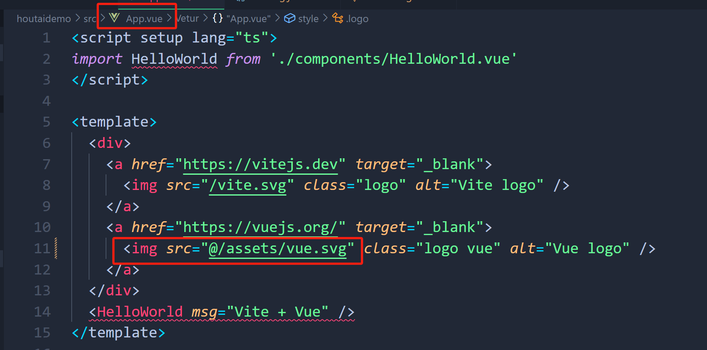

# 配置路径别名使用@代替/src
配置代码如下：
```
import { defineConfig } from 'vite'
import vue from '@vitejs/plugin-vue'
// 以下三项引入是为配置Element-plus自动按需导入
import AutoImport from 'unplugin-auto-import/vite'
import Components from 'unplugin-vue-components/vite'
import { ElementPlusResolver } from 'unplugin-vue-components/resolvers'

// 使用 @ 代替/src
import{ resolve } from 'path'

// https://vitejs.dev/config/
export default defineConfig({
  plugins: [vue(),
      // 以下两项是为配置Element-plus自动按需导入
      AutoImport({
        resolvers: [ElementPlusResolver()],
      }),
      Components({
        resolvers: [ElementPlusResolver()],
      }),
  ],
  resolve:{
    alias:[{
      find:'@',
      replacement:resolve(__dirname,'./src')
    }]
  }
})

```
主要代码：
```
// 使用 @ 代替/src
import{ resolve } from 'path'

  resolve:{
    alias:[{
      find:'@',
      replacement:resolve(__dirname,'./src')
    }]
  }

```

# 根目录下tsconfig.json 文件配置
配置@

在键值compilerOptions 下加入：
```
    //配置 @
    "baseUrl": ".",
    "paths": {
      "@/*": ["src/*"]
    }
```
完整代码如下：
```
{
  "compilerOptions": {
    "target": "ES2020",
    "useDefineForClassFields": true,
    "module": "ESNext",
    "lib": ["ES2020", "DOM", "DOM.Iterable"],
    "skipLibCheck": true,
    "types": ["element-plus/global"],
    /* Bundler mode */
    "moduleResolution": "bundler",
    "allowImportingTsExtensions": true,
    "resolveJsonModule": true,
    "isolatedModules": true,
    "noEmit": true,
    "jsx": "preserve",

    /* Linting */
    "strict": true,
    "noUnusedLocals": true,
    "noUnusedParameters": true,
    "noFallthroughCasesInSwitch": true,
    //配置 @
    "baseUrl": ".",
    "paths": {
      "@/*": ["src/*"]
    }
  },
  "include": ["src/**/*.ts", "src/**/*.tsx", "src/**/*.vue"],
  "references": [{ "path": "./tsconfig.node.json" }]
}

```
# 使用

在App.vue 中修改如图所示：

启动页面：


